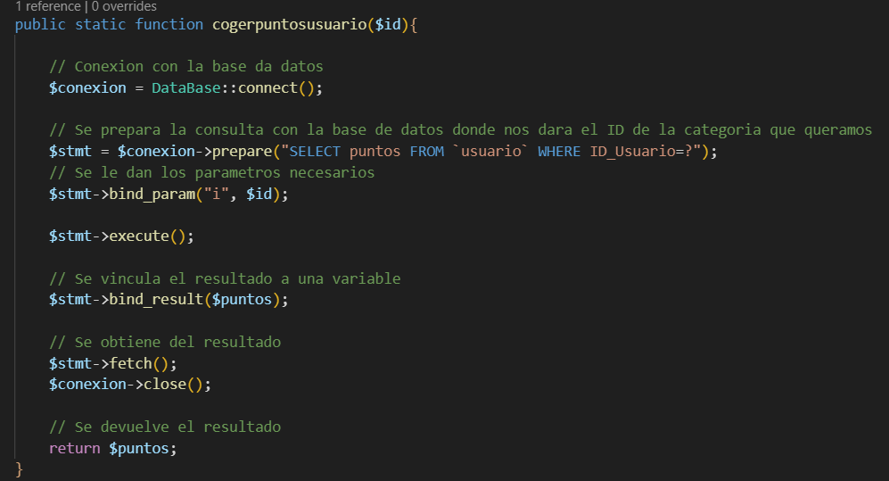
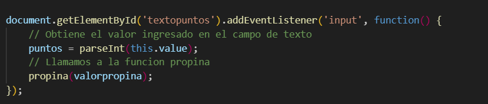
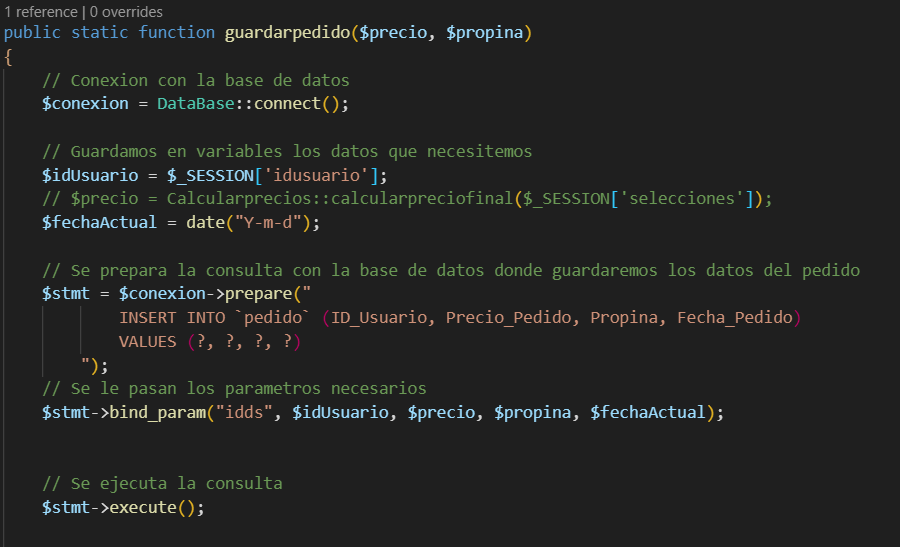

# Reseñas
## Añadir reseñas
Para añadir comentario he hecho un formulario donde pones el nombre, el comentario y la valoración.

En el nombre hay puesta una **p** sin nada porque ahí se pondrá un texto cuando no hayas iniciado sesión mirando a través de la api.

Esto se mirará haciendo una consulta a una variable de sesión que se crea cuando iniciamos sesión si existe es que el usuario a iniciado sesión si no existe no lo ha hecho.

La otra cosa que hace el JS en esta pagina es cunado intenta añadir el comentario.

Si no están todos los campos rellenados saltará un mensaje de error.

Si están todos llenos te dará un mensaje diciendo que se ha añadido el comentario y mandara los datos de este a la api.

En la api lo que se hace es recoger los datos y enviarlos al comentarioDAO para que los añada a la base de datos.

El comentarioDAO agrega el comentario a la base de datos mediante una consulta SQL diferenciando si se ha escogido la opción de anónimo o el nombre de usuario.

## Mostrar reseñas
El panel para mostrar las reseñas tiene unos filtros para modificar los comentarios que se muestran, un botón para añadir los comentarios y una sección que es donde se mostraran los comentarios.

Al cargar la pagina lo que hace en JS es llamar a la api para que le de todos los comentarios y mostrarlos.

La api lo que hace es llamar a comentarioDAO para que saque de la base de datos todos los comentarios.

El primer filtro llama a la api dependiendo de que opcion hayas escogido y muestra esos comentarios.

La api llama al comentarioDAO que saca los comentarios con las características que piden.

Para filtrar por estrellas lo que se hace es guardar en una array los valores de las estrellas que se van seleccionando y deseleccionando.

Y a partir de la array mostrar únicamente los comentarios que tenga una valoración igual a alguno de los valores de la array. Si la array está vacía hace lo anterior.

Para el ascendente y descendente se mira cual de los dos está seleccionado y se filtra en ese orden.

Para mostrar los comentarios con los filtros lo que se mira primero es si existen comentarios después de aplicarle todos los filtros, si no existen pone un mensaje.

Si por el contrario se agregan los comentarios que hayan.

# LocalStorage
Para el localStorage  lo que hace es que a la que pulsas el botón de comprar en el PHP 

El JS recibe datos de la api del ultimo pedido.

La api lo que hace es a partir de una variable de sesión donde se guardan los productos de la cesta. Saca todos los valores de ella para enviárselos por JSON al JS.

Una vez que el JS tiene los datos lo que hace es montar una cadena de texto con los datos necesarios y ponerlos en el localStorage.

# QR
Para el QR lo se hace es primero recoger los datos del localStorage donde pasaremos esos datos a una api externa que te da un QR con los datos del pedido.

Al sacar los datos del localStorage no me hacia los saltos de línea hasta que le puse el **encodeURIcomponent**

Luego insertamos ese QR en la pagina 

# Propinas
En la pagina hay 3 posibles propinas que puedes dar además de marcar que no quieres ninguna donde por defecto siempre estará marcado el 3% del total.

Cuando la pagina carga se hace el calculo de la propina con el 3% desde el JS

Y cada vez que hay un cambio en la propina seleccionada se calcula de nuevo.

Para insertar la propina en la pagina y mostrar el precio final lo hago con la función propina.

El calculo se hace con el precio final que lo que hace es llamar a la api para que te de el precio de todos los productos de la cesta.

Esto la api lo hace calculando el precio de los productos que hay en la variable de sesión donde se guardan los productos de la cesta y pasando-lo por una calculadora que he creado.

El como se guarda la propina en la base de datos lo mostrare después en conjunto a la fidelidad

# Fidelidad
Para los puntos en la vista se ha puesto un pequeño formulario para poder seleccionar si gastas o no puntos.

Aunque también si no has iniciado sesión no te dejara gastar puntos.

Lo primero que se hace al cargar la pagina es sacar los puntos del usuario mediante la api para decirle al usuario cuantos puntos tiene.

Para que la api le de los pintos al usuario uso el usuarioDAO para que me saque los puntos de la base de datos.

Si intentas gastar puntos y no tienes te da un mensaje de error, si tienes se activa la opcion de marcar cuantos puntos quieres gastar.

Si ya no quieres gastar puntos y pulsas el no te bloquea la posibilidad de escribir puntos, te lo limpia y te hace un calculo del total sin gastar ningún punto.

Cunado esta habilitado el escribir los puntos que quieres gastar cada vez que escribes un numero este se guarda en una variable para hacer los calculos.

Al ir a hacer el calculo de los puntos hay unas cuantas restricciones.

La primera es que si quieres poner números negativos te da un mensaje de error, te limpia los puntos que hayas escrito y te hace los cálculos con los puntos a 0.

La segunda es que si quieres gastar mas puntos de los que tienes te da un mensaje de error, te limpia los puntos que hayas escrito y te hace los cálculos con los puntos a cero.

Si los puntos están bien escritos pueden pasar dos cosas mas que gastes mas puntos de lo que cueste el pedido que en tal caso lo que hace es poner el total a cero y la otra es que borres manualmente los puntos que has escrito y lo dejes sin nada que lo que hará es calcular sin tener en cuenta los puntos.

Una vez haya pasado todos los calculos lo que se hace es dividir entre diez el precio total haciendo que cada diez euros que pages es un punto que te dan.

Ahora para que se guarden la propina y los puntos en la base de datos que hace una llamada a la api pasandole todos los datos que se hayan modificados.

La api lo recibe todo, hace un calculo para saber cuantos puntos le quedan al usuario después de la compra y usa al usuarioDAO y al pedidousuarioDAO para guardar los puntos y el pedido en la base de datos.

# Filtro productos
Para el filtro de los productos lo que hago es crear los filtros 

Y luego en el JS se mira cual se va pulsando para ponerle un estilo que vuelve al elemento invisible si el checkbox esta pulsado o visible si no lo está. Esto se hace cuando la clase del elemento es la misma que el valor del checkbox seleccionado.

